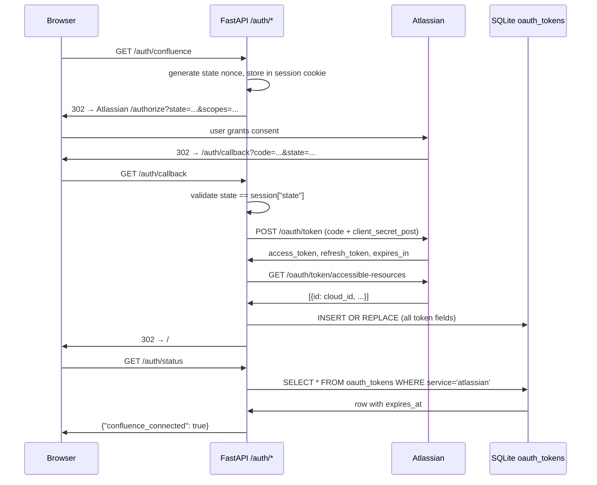
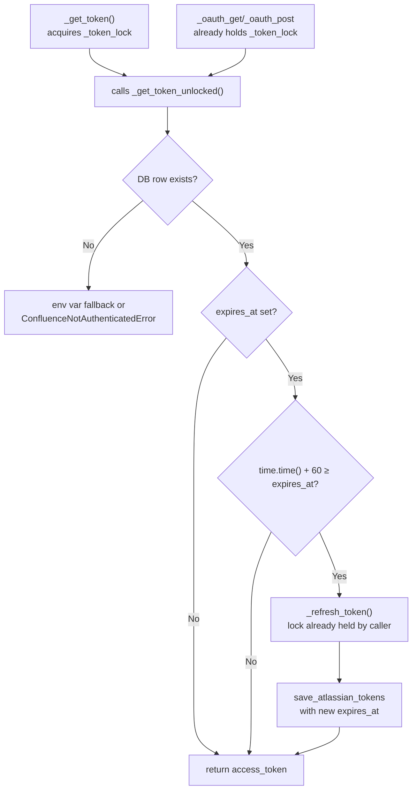

# feat: In-App Confluence OAuth with SQLite Token Store and Proactive Pre-Refresh

Three-change rewrite that moves Atlassian OAuth auth into FastAPI routes, stores tokens atomically in SQLite, and proactively refreshes before expiry. Together these eliminate the 5-step manual CLI bootstrap, close the rotating-token permanent-lockout race condition, and prevent mid-job 401s from token expiry.

---

## Problem Frame

The Atlassian OAuth flow lives in `scripts/atlassian_oauth.py` as a standalone script. Tokens are stored in `.env` as plaintext. Token refresh fires only on 401. Three failure modes result:

1. **Manual bootstrap** — dev must run a script, copy stdout, paste into `.env`, restart the server.
2. **Permanent lockout** — Atlassian rotating refresh tokens mean a crash between the token exchange response and the `.env` write permanently invalidates access. The old token is gone; re-auth requires the full manual flow again.
3. **Mid-job 401s** — no expiry tracking means the access token (~3600s TTL) can expire during a generation run, producing Confluence 404s mid-stream.

---

## Requirements

**In-App OAuth Routes**
- R1. `main.py` exposes `GET /auth/confluence`, `GET /auth/callback`, and `GET /auth/status`.
- R2. `GET /auth/confluence` generates a state nonce, stores it in the Starlette session cookie, and redirects to the Atlassian authorization URL with the required scopes.
- R3. `GET /auth/callback` validates state against the session (400 on mismatch), exchanges the code for tokens using `client_secret_post`, fetches `cloud_id` from the accessible-resources endpoint, writes all tokens atomically to `oauth_tokens`, and redirects to `/`.
- R4. `SessionMiddleware` is added to `main.py` with `SESSION_SECRET` from env; unset on startup logs a warning and falls back to a random secret (sessions lost on restart in this mode).
- R5. `GET /auth/status` returns `{"confluence_connected": bool}` based on the presence of a non-expired `atlassian` row in `oauth_tokens`. This route requires no API key.
- R6. `static/index.html` adds a "Connect Confluence" anchor (href=`/auth/confluence`) and a "Confluence ✓" indicator in the header; `app.js` polls `/auth/status` on page load and toggles visibility.

**SQLite Token Store**
- R7. `db.py` adds an `oauth_tokens` table with columns `service` (PK), `access_token`, `refresh_token`, `expires_at` (Unix timestamp), `cloud_id`, `updated_at`. (`client_id` and `client_secret` are read from env only and not stored in the DB — see KTD.)
- R8. `db.py` exposes `get_atlassian_tokens() -> dict | None` and `save_atlassian_tokens(...)` helpers; `save` uses `INSERT OR REPLACE` in a single transaction.
- R9. `_get_token()`, `_api_base()`, and `_refresh_token()` in `confluence.py` read tokens, `cloud_id`, and client credentials from `oauth_tokens` rather than `os.environ`.
- R10. `_persist_env_tokens()` is replaced by `_persist_db_tokens()` which calls `save_atlassian_tokens()`; the `.env` file write is removed.
- R11. On startup (in the existing `@app.on_event("startup")` handler), if `oauth_tokens` has no `atlassian` row and `ATLASSIAN_OAUTH_TOKEN` is set in env, tokens are auto-migrated from env vars and the migration is logged.
- R12. The SQLite DB file is excluded from git; `itsdangerous` is added to `requirements.txt`.

**Proactive Pre-Refresh**
- R13. `_refresh_token()` stores `expires_at = int(time.time()) + expires_in` when writing tokens; absent `expires_in` stores `None`.
- R14. `_get_token()` acquires `_token_lock`, reads the token row, and calls `_refresh_token()` proactively if `expires_at` is set and `time.time() + 60 >= expires_at`.
- R15. The reactive 401 refresh path in `_oauth_get()` and `_oauth_post()` is preserved as a safety net.

---

## Key Technical Decisions

- **`client_secret_post` without PKCE.** Confirmed: the Atlassian developer console app is registered as **Confidential** (server-side app type). Per Atlassian docs, confidential clients may use `client_secret` alone without PKCE. The existing `scripts/atlassian_oauth.py` and `_refresh_token()` already use `client_secret_post` without a code verifier, confirming the registration type. If the app is re-registered as a Public client, PKCE must be reinstated.

- **Proactive pre-refresh runs under `_token_lock`.** `docs/solutions/security-issues/confluence-cql-injection-and-api-hardening.md` confirmed that holding `_token_lock` across the refresh HTTP call is the correct pattern to prevent double-refresh races. The proactive path follows the same shape as the existing reactive path in `_oauth_get`/`_oauth_post`. Restructuring to "unlock before I/O" would re-introduce the race.

- **`_api_base()` and `_refresh_token()` also move to DB reads.** NFR-2 in the origin doc requires that `client_id`, `client_secret`, and `cloud_id` survive env resets after first auth. Both functions currently read from `os.environ` (`confluence.py:71-74`, `confluence.py:112-113`); both must read from `oauth_tokens` with an env var fallback during the migration window.

- **Auto-migration fires in the startup event handler, not lazily.** `load_dotenv()` fires at `agent.py` import time, populating `os.environ` before FastAPI's `@app.on_event("startup")` runs. This ordering makes migration deterministic — tokens are in the DB before any request reaches `_get_token()`.

- **`run_in_executor` for DB calls from async routes.** `db.py` uses a synchronous SQLite connection (`check_same_thread=False`). The new async `/auth/*` routes follow the existing pattern (`main.py:191`, `main.py:234`) of wrapping DB calls with `await loop.run_in_executor(None, ...)`. DB calls inside sync functions (`_get_token`, `_refresh_token`) do not need the executor wrapper.

- **`client_id` and `client_secret` read from env only.** The `oauth_tokens` table does not store `client_id` or `client_secret`. `_refresh_token()` reads `ATLASSIAN_CLIENT_ID` and `ATLASSIAN_CLIENT_SECRET` from `os.environ` (they remain in `.env` permanently per NFR-2). Storing static credentials in the DB adds attack surface — anyone who exfiltrates the DB file can impersonate the app indefinitely. The `client_id`/`client_secret` columns are removed from the DDL.

---

## High-Level Technical Design

### OAuth Callback Sequence

### Proactive Pre-Refresh and Lock Flow

---

## Implementation Units

### U1. `oauth_tokens` table and helpers in `db.py`

**Goal:** Add the `oauth_tokens` table and the two helper functions all other units depend on.

**Requirements:** R7, R8

**Dependencies:** none

**Files:**
- `db.py`

**Approach:** Add the `oauth_tokens` DDL to the existing `conn.executescript()` block in `init()` (`db.py:17`, imported as `db_init` in `main.py`). `get_atlassian_tokens()` executes a `SELECT * FROM oauth_tokens WHERE service='atlassian'` and returns the row as a dict or `None`. `save_atlassian_tokens()` executes `INSERT OR REPLACE INTO oauth_tokens VALUES (...)` with all columns in a single `conn.execute()` call — SQLite's default isolation level makes this atomic. Set `updated_at = int(time.time())` inside the helper.

**Patterns to follow:** Existing `init()` `executescript` at `db.py:17`; existing `conn.execute()` style throughout `db.py`.

**Test scenarios:**
- `get_atlassian_tokens()` returns `None` when the table is empty.
- `save_atlassian_tokens(...)` followed by `get_atlassian_tokens()` returns all saved fields.
- Calling `save_atlassian_tokens(...)` twice with different values returns the second values (REPLACE behavior).
- `updated_at` is set to a non-null timestamp after save.
- `expires_at=None` stores as SQL `NULL`; `get_atlassian_tokens()` returns `None` for that field.

**Verification:** `init()` runs without error; `sqlite3 coverage.db ".schema oauth_tokens"` shows the expected columns.

---

### U2. Token storage swap in `confluence.py`

**Goal:** Replace env var reads/writes with DB-backed equivalents in `_get_token()`, `_api_base()`, `_refresh_token()`, and `_persist_env_tokens()`.

**Requirements:** R9, R10

**Dependencies:** U1

**Files:**
- `tools/confluence.py`

**Approach:**
- `_get_token()` (currently `confluence.py:108`) calls `get_atlassian_tokens()` and returns `row["access_token"]`. Falls back to `os.environ.get("ATLASSIAN_OAUTH_TOKEN", "")` when no DB row exists (migration window backward compat).
- `_api_base()` (currently `confluence.py:112`) reads `cloud_id` from `get_atlassian_tokens()["cloud_id"]`, falling back to `os.environ.get("ATLASSIAN_CLOUD_ID", "")`.
- `_refresh_token()` (currently `confluence.py:71`) reads `refresh_token` from `get_atlassian_tokens()` and reads `ATLASSIAN_CLIENT_ID`/`ATLASSIAN_CLIENT_SECRET` from `os.environ` (static credentials remain in env, not stored in DB per KTD). Calls `_persist_db_tokens()` after a successful exchange.
- `_get_cloud_id()` — new helper: reads `cloud_id` from `get_atlassian_tokens()["cloud_id"]`, falling back to `os.environ.get("ATLASSIAN_CLOUD_ID", "")`. Used by `_api_base()`, `get_ts_space_id()`, and `find_parent_page_id()`.
- Also update `get_ts_space_id()` (`confluence.py:232`) and `find_parent_page_id()` (`confluence.py:252`): replace the `os.environ.get("ATLASSIAN_CLOUD_ID")` guard with `_get_cloud_id()`.
- `ConfluenceNotAuthenticatedError` — new custom exception defined at the top of `confluence.py`. When both DB row and env var are absent, `_get_token()`, `_api_base()`, and `_get_cloud_id()` raise it. Callers in `agent.py` catch it and surface a readable SSE error: `"Confluence not connected — visit /auth/confluence to authenticate"` rather than an `AttributeError` traceback.
- `_persist_env_tokens()` (currently `confluence.py:41`) is renamed `_persist_db_tokens()`, calls `save_atlassian_tokens()` with all fields. The `.env` file write block is removed.
- Error handling: the `save_atlassian_tokens()` call site uses `except Exception as e: logger.warning(...)` — no bare `except: pass` (per the security solution doc's Fix 6).
- The double-check pattern in `_oauth_get`/`_oauth_post` is preserved; see U3 for how the re-read call changes from `_get_token()` to `_get_token_unlocked()`.

**Patterns to follow:** Existing `_get_token()` at `confluence.py:108`; existing `_persist_env_tokens()` at `confluence.py:41`; error-handling discipline from `docs/solutions/security-issues/confluence-cql-injection-and-api-hardening.md`.

**Test scenarios:**
- `_get_token()` returns `access_token` from a pre-seeded `oauth_tokens` row.
- `_get_token()` falls back to `os.environ["ATLASSIAN_OAUTH_TOKEN"]` when no DB row exists.
- `_get_token()` with no DB row and no env var raises `ConfluenceNotAuthenticatedError`.
- `_api_base()` returns the correct URL using `cloud_id` from the DB row via `_get_cloud_id()`.
- `_refresh_token()` reads `ATLASSIAN_CLIENT_ID`/`ATLASSIAN_CLIENT_SECRET` from `os.environ` and `refresh_token` from the DB row.
- `get_ts_space_id()` with a seeded `oauth_tokens` row (no `ATLASSIAN_CLOUD_ID` env var) returns the expected space ID without raising.
- `find_parent_page_id()` same.
- `_persist_db_tokens()` stores all fields; `get_atlassian_tokens()` returns them.
- A DB write failure in `_persist_db_tokens()` raises (logged via `logger.warning`) — no silent pass.
- The double-check pattern in `_oauth_get()`: after acquiring `_token_lock`, a call to `_get_token_unlocked()` reflects the refreshed token if another thread already refreshed.

**Verification:** App starts; a pre-seeded `oauth_tokens` row allows Confluence tool calls to succeed without any env vars set.

---

### U3. Proactive pre-refresh in `confluence.py`

**Goal:** Add `expires_at` tracking to `_refresh_token()` and pre-refresh logic to `_get_token()`.

**Requirements:** R13, R14, R15

**Dependencies:** U2

**Files:**
- `tools/confluence.py`

**Approach:**
- `_refresh_token()` extracts `expires_in` from the Atlassian token response and passes `expires_at = int(time.time()) + expires_in` to `_persist_db_tokens()`/`save_atlassian_tokens()`. If `expires_in` is absent from the response, passes `expires_at=None`.
- Extract `_get_token_unlocked()` — a lock-free helper that reads the DB row (via `get_atlassian_tokens()`), applies the env-var fallback / raises `ConfluenceNotAuthenticatedError`, and calls `_refresh_token()` proactively if `expires_at` is set and `time.time() + 60 >= expires_at`. This helper must only be called by code that already holds `_token_lock`.
- `_get_token()` (the public entrypoint for callers outside the lock) acquires `_token_lock` and delegates to `_get_token_unlocked()`.
- `_oauth_get()` and `_oauth_post()` already hold `_token_lock`; they call `_get_token_unlocked()` directly to avoid re-acquiring the non-reentrant lock. The existing double-check re-read inside those functions becomes `_get_token_unlocked()`.
- The reactive 401 refresh path in `_oauth_get()` and `_oauth_post()` is unchanged in structure.

**Execution note:** Implement the proactive pre-refresh with a failing test first — seed a near-expired token row, call `_get_token()`, assert the returned token is different from the seeded one.

**Patterns to follow:** Reactive 401 refresh in `_oauth_get()` at `confluence.py:117-137`; `_token_lock` invariant from `docs/solutions/security-issues/confluence-cql-injection-and-api-hardening.md`.

**Test scenarios:**
- Token with `expires_at = now + 30` triggers a refresh; `_get_token()` returns the new token.
- Token with `expires_at = now + 120` returns the existing token without refreshing.
- Token with `expires_at = None` returns the existing token without refreshing.
- Two concurrent `_get_token()` calls when the token is near-expiry: exactly one refresh fires; the second caller reads the already-refreshed token via the double-check re-read.
- Concurrent call to `_oauth_get()` (which holds `_token_lock`) with a near-expired token does not deadlock; proactive refresh fires inside `_get_token_unlocked()` without re-acquiring the lock.
- `expires_in` absent from Atlassian response: `expires_at` stored as `None`; no error raised.
- After a proactive refresh, the new `expires_at` stored in the DB is `> now + 3500`.

**Verification:** Seed an `oauth_tokens` row with `expires_at = int(time.time()) + 30`; call `_get_token()`; confirm the row's `access_token` changed and `expires_at` was extended.

---

### U4. In-app OAuth routes and `SessionMiddleware` in `main.py`

**Goal:** Add `SessionMiddleware`, the three `/auth/*` routes, and the startup migration hook.

**Requirements:** R1, R2, R3, R4, R5 (backend portion), R11, R12 (itsdangerous)

**Dependencies:** U1, U2

**Files:**
- `main.py`
- `requirements.txt`

**Approach:**
- Add `itsdangerous` to `requirements.txt` (verify first — it may already be present as a transitive Starlette dependency via `pip show itsdangerous`).
- At app startup, read `SESSION_SECRET` from `os.environ`. If absent or empty, raise `RuntimeError("SESSION_SECRET is not set. Generate one with: python -c \"import secrets; print(secrets.token_hex(32))\"")` and abort — a missing secret key makes OAuth state cookies trivially forgeable.
- Add `app.add_middleware(SessionMiddleware, secret_key=SESSION_SECRET, same_site="lax", https_only=False)` before the `StaticFiles` mount (`main.py:25`). `same_site="lax"` is correct for the localhost redirect flow; `https_only=False` is required for localhost development. In any non-localhost deployment, `https_only` must be `True`.
- `GET /auth/confluence`: generate a state nonce with `secrets.token_urlsafe(16)`, store as `request.session["state"]`, construct the Atlassian auth URL (endpoint from `atlassian_oauth.py:46`, scopes from `atlassian_oauth.py:17`), and return `RedirectResponse`.
- `GET /auth/callback`: read `code` and `state` from `request.query_params`; raise `HTTPException(400)` on state mismatch; POST to the Atlassian token endpoint using `grant_type: "authorization_code"` with `code`, `redirect_uri: "http://localhost:8000/auth/callback"`, `client_id`, and `client_secret` (note: `confluence.py:79-88` uses `grant_type: "refresh_token"` — use the same httpx + JSON body pattern but the authorization_code payload); GET accessible-resources; call `await loop.run_in_executor(None, save_atlassian_tokens, ...)` with all fields; return `RedirectResponse("/")`.
- `GET /auth/status`: call `await loop.run_in_executor(None, get_atlassian_tokens)`; return `{"confluence_connected": row is not None and (row["expires_at"] is None or row["expires_at"] > int(time.time()))}`. No `Depends(require_api_key)`.
- Startup migration helper `_migrate_tokens_from_env()`: called at the end of `@app.on_event("startup")` after `db_init()`. Checks `get_atlassian_tokens() is None` and `os.environ.get("ATLASSIAN_OAUTH_TOKEN")`. If both true, calls `save_atlassian_tokens(...)` with env vars and logs the migration. Always logs the outcome (migrated / skipped / error).

**Patterns to follow:** Existing routes at `main.py:74-184`; `run_in_executor` at `main.py:191`, `main.py:234`; startup handler at `main.py:59-69`.

**Test scenarios:**
- `GET /auth/confluence` returns 302 with `Location` containing `auth.atlassian.com/authorize`.
- `GET /auth/confluence` stores `state` in the session.
- `GET /auth/callback` with matching state and a stubbed token endpoint writes to DB and redirects to `/`.
- `GET /auth/callback` with mismatched state returns 400.
- `GET /auth/callback` where the token exchange fails returns an appropriate error (not a 500 with a traceback).
- `GET /auth/status` returns `confluence_connected: false` with an empty DB.
- `GET /auth/status` returns `confluence_connected: true` after a seeded `oauth_tokens` row with future `expires_at`.
- `GET /auth/status` returns `confluence_connected: false` when `expires_at` is in the past.
- `GET /auth/status` returns 200 without `X-Api-Key` header.
- Startup migration: env token present + empty DB → row created + migration log line emitted.
- Startup migration: row already present → no-op, no error.
- App startup with `SESSION_SECRET` unset raises `RuntimeError` before `SessionMiddleware` is registered.
- Startup migration: no env token, empty DB → no-op, no error.

**Verification:** Complete an end-to-end OAuth flow in a browser (against the real or a mocked Atlassian); confirm the `oauth_tokens` row exists; confirm `/auth/status` returns `true`.

---

### U5. Frontend connection button and status polling

**Goal:** Add the "Connect Confluence" header button and status indicator in the frontend.

**Requirements:** R6

**Dependencies:** U4

**Files:**
- `static/index.html`
- `static/app.js`

**Approach:**
- `index.html`: add a `
` in the header alongside the existing nav tabs. Contains an `<a id="confluence-connect" href="/auth/confluence">Connect Confluence</a>` and a `Confluence ✓`.
- `app.js`: add `checkConfluenceStatus()` which calls `fetch("/auth/status")` (no API key header), reads `confluence_connected`, shows the anchor when `false`, shows the span when `true`. Also reads `window.location.search` on `DOMContentLoaded`: if `auth_error` query param is present, renders an inline error message near the button ("Connection failed — try again" for `access_denied`; "Something went wrong — try again" for `exchange_failed`). On network error, default to showing the button.
- On anchor click, `app.js` disables the element and changes its text to "Connecting…" before navigation fires. The full-page redirect resets the DOM on return — no teardown needed.
- The anchor navigates via `href`, not `fetch()` — the OAuth redirect requires a full browser navigation.
- Toggle mechanism: `element.style.display = "none"` / `"inline"` (matching the `style="display:none"` initial state set in HTML). The button's initial visible state prevents flash before JS runs; the indicator's `style="display:none"` is already specified.
- Auth failure convention: `/auth/callback` redirects to `/?auth_error=access_denied` (user cancelled) or `/?auth_error=exchange_failed` (token exchange error) instead of returning a raw HTTP error page.

**Patterns to follow:** Existing nav tab structure in `static/index.html`; `classifyError()` in `app.js:14`; `fetch()` pattern in `app.js`.

**Test scenarios:**
- `/auth/status` → `false`: button visible, indicator hidden.
- `/auth/status` → `true`: indicator visible, button hidden.
- Network error on `/auth/status`: button remains visible (no error state rendered).
- Button `href` attribute is `/auth/confluence` (verified in DOM, not a fetch call).
- User clicks "Connect Confluence": anchor becomes disabled with text "Connecting…".
- Page load with `?auth_error=access_denied`: inline "Connection failed — try again" message rendered near button; button remains visible.
- Page load with `?auth_error=exchange_failed`: inline "Something went wrong — try again" rendered near button.

**Verification:** Start server with empty DB → button visible. Complete auth flow → indicator visible. Reload the page → indicator persists. Cancel the Atlassian consent screen → redirected back with error message visible.

---

### U6. Docs, config, and deprecation

**Goal:** Update supporting files to make the new auth flow self-documenting and keep the repo clean.

**Requirements:** R12 (`.gitignore`), R4 (`SESSION_SECRET` docs), success criteria §1 (zero manual steps)

**Dependencies:** none

**Files:**
- `.env.example`
- `.gitignore`
- `scripts/atlassian_oauth.py`

**Approach:**
- `.env.example`: add `SESSION_SECRET=` with comment `# Generate with: python -c "import secrets; print(secrets.token_hex(32))"`. Add a comment noting the Atlassian developer console callback URL must be updated to `http://localhost:8000/auth/callback`.
- `.gitignore`: verify `*.db` or the specific SQLite filename is listed; add if absent.
- `scripts/atlassian_oauth.py`: add a deprecation comment block at the top: the in-app `/auth/confluence` route replaces this script; the script is kept for reference only.

**Test scenarios:**
- Test expectation: none — config and comment changes only; verify by inspection.

**Verification:** `.env.example` contains `SESSION_SECRET`; `.gitignore` contains a `.db` exclusion; `atlassian_oauth.py` has a visible deprecation comment.

---

## Scope Boundaries

### Deferred to Follow-Up Work
- Idea 4 (Confluence status indicator widget) and Idea 5 (reconnect CTA on 401 error) from the ideation doc — these build on this rewrite.
- PKCE code flow — relevant only if the app registration type changes from confidential to public.

### Outside This Change
- PAT fallback (`create_draft_page_pat`) — untouched.
- Multi-user auth — single-tenant scope only.
- Authlib integration — `httpx` direct matches the existing pattern.

---

## Risks & Dependencies

- **Atlassian developer console callback URL** — must be updated from `http://localhost:9876/callback` to `http://localhost:8000/auth/callback` before the flow works. Both URLs can be registered simultaneously during the transition. This is a one-time manual step outside the code.
- **`itsdangerous` not yet installed** — `pip install -r requirements.txt` after the `requirements.txt` update. App will fail to start with an `ImportError` until this is installed.
- **Migration failure is silent without logging** — if `save_atlassian_tokens()` raises during the startup migration, the user will see a 401 on first generation. Mitigation: log both migration success and failure explicitly; never bare `except`.
- **`_token_lock` held across HTTP call** — this is intentional (matching the existing reactive path) but worth noting: a slow or hung token refresh will block all concurrent Confluence API calls until the lock is released. This is acceptable for a single-tenant dev tool.

---

## System-Wide Impact

All Confluence API call paths that reach `_get_token()`, `_api_base()`, or `_refresh_token()` now read from SQLite rather than `os.environ`. The `SessionMiddleware` adds a session cookie to all responses — no existing routes read the session, so there is no behavioral change outside the `/auth/*` routes. The startup migration is additive to the existing `@app.on_event("startup")` handler.

---

## Documentation / Operational Notes

- The Atlassian developer console callback URL change is the only external setup step. Document it prominently in the README and `.env.example`.
- After the first successful auth, `ATLASSIAN_OAUTH_TOKEN`, `ATLASSIAN_REFRESH_TOKEN`, and `ATLASSIAN_CLOUD_ID` can be removed from `.env` (tokens are now in the DB). `ATLASSIAN_CLIENT_ID` and `ATLASSIAN_CLIENT_SECRET` remain in `.env` permanently — they are not stored in the DB and are required on every token refresh.
- `SESSION_SECRET` should not be rotated — sessions are only used during the OAuth handshake, but rotation would break any in-flight OAuth flow at restart time.
- If the SQLite DB file is deleted, the user must re-authenticate via the browser button. No data beyond OAuth credentials is lost.

---

## Sources & Research

- `docs/solutions/security-issues/confluence-cql-injection-and-api-hardening.md` — confirmed `_token_lock` + refresh HTTP call is the correct pattern; proactive pre-refresh must follow the same shape
- `docs/brainstorms/2026-06-25-confluence-oauth-auth-requirements.md` — origin document; all FRs and NFRs traced above
- `scripts/atlassian_oauth.py:17,46,70,91` — canonical OAuth scopes, endpoint URLs, and auth URL pattern
- `tools/confluence.py:36-159` — existing lock, refresh, token management, and double-check patterns
- `db.py:5-17` — existing SQLite connection setup and `init()` startup pattern (imported as `db_init` in `main.py`)
- `main.py:59-69` — startup event handler where migration hook attaches
- `main.py:191,234,248` — `run_in_executor` pattern for DB calls from async routes
